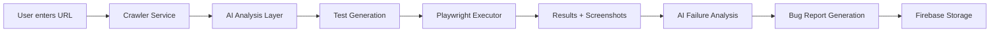
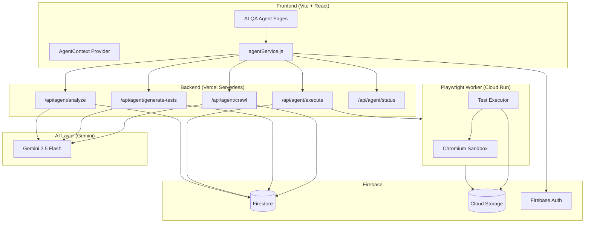
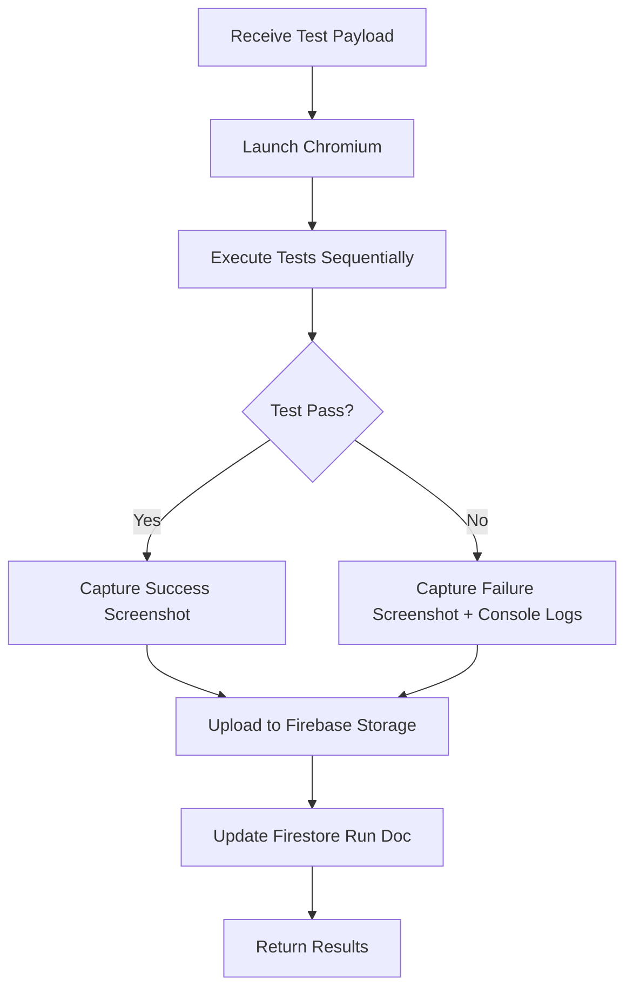
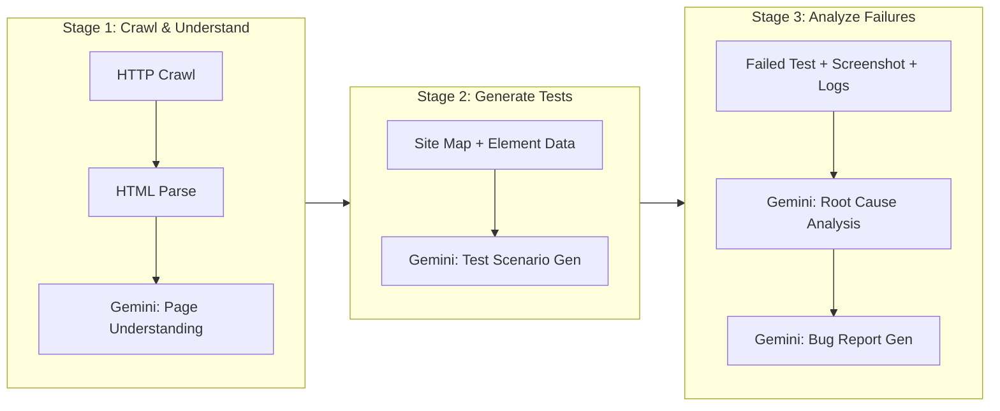
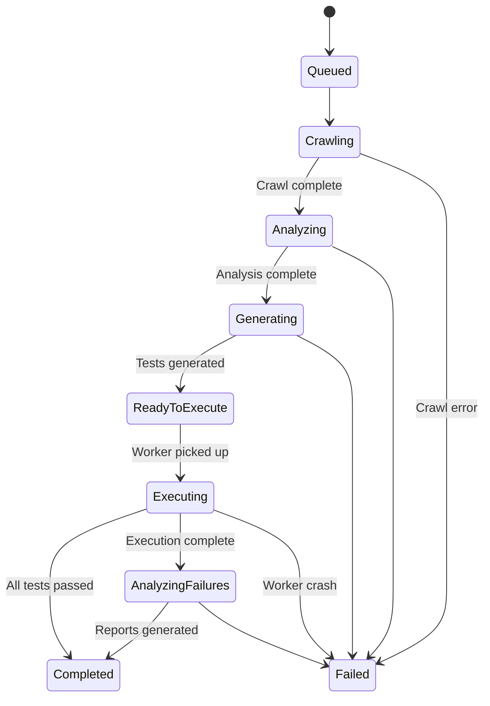

# AI QA Agent — Complete System Architecture

> **Module**: AI QA Agent for Qualia  
> **Author**: Principal Architect  
> **Date**: July 2026  
> **Status**: Architecture Design (Pre-Implementation)

---

## 1. Executive Summary

The AI QA Agent is a new module within Qualia that automates end-to-end website testing. A user provides a URL → the system crawls, understands the site structure, generates Playwright tests via AI, executes them, captures evidence, analyzes failures, and produces professional bug reports — all saved to Firebase.



---

## 2. High-Level Architecture



> [!IMPORTANT]
> Playwright **cannot** run inside Vercel serverless functions (10s/60s timeout, no browser binary). It must run on a dedicated **Cloud Run** container or similar long-running compute.

---

## 3. Frontend Architecture

### 3.1 New Pages

| Page | Route | Purpose |
|------|-------|---------|
| AgentDashboard | `/qa/agent` | URL input, run history, status overview |
| RunDetailPage | `/qa/agent/runs/:runId` | Full results for a single run |
| TestResultPage | `/qa/agent/runs/:runId/tests/:testId` | Individual test detail with screenshots |

### 3.2 New Components

```
src/
├── pages/
│   └── agent/
│       ├── AgentDashboardPage.jsx
│       ├── RunDetailPage.jsx
│       └── TestResultPage.jsx
├── components/
│   └── agent/
│       ├── UrlInputPanel.jsx        # URL entry + config options
│       ├── CrawlProgressCard.jsx    # Live crawl status
│       ├── SitemapViewer.jsx         # Visual site structure
│       ├── TestScenarioList.jsx      # Generated test list
│       ├── ExecutionTimeline.jsx     # Real-time execution feed
│       ├── ScreenshotGallery.jsx     # Before/after screenshots
│       ├── BugReportPreview.jsx      # AI-generated bug preview
│       └── AgentRunCard.jsx          # Run history card
├── services/
│   └── agentService.js              # All API calls for AI Agent
├── contexts/
│   └── AgentContext.jsx             # Polling + state management
└── styles/
    └── agent.css                    # Module-specific styles
```

### 3.3 Integration with Existing App

Add routes inside `QAPortal` in `App.jsx`:

```jsx
// Inside QAPortal Routes
<Route path="agent" element={<AgentDashboardPage />} />
<Route path="agent/runs/:runId" element={<RunDetailPage />} />
<Route path="agent/runs/:runId/tests/:testId" element={<TestResultPage />} />
```

Add nav item to existing `Sidebar.jsx` with a `Bot` icon from lucide-react.

### 3.4 State Management

Use a new `AgentContext` provider (following existing `AuthContext` pattern):

- **Polling-based** status updates (every 5s while run is active)
- Firestore `onSnapshot` listener for run document changes
- Local state for URL input, config, and UI interactions

---

## 4. Backend Architecture

### 4.1 API Layer (Vercel Serverless Functions)

All endpoints live under `api/agent/` and follow existing patterns from `_geminiHelper.js`:

| Endpoint | Method | Purpose | Timeout |
|----------|--------|---------|---------|
| `/api/agent/crawl` | POST | Initiate crawl + AI analysis | 60s |
| `/api/agent/generate-tests` | POST | Generate Playwright scenarios | 60s |
| `/api/agent/execute` | POST | Trigger Playwright execution on Cloud Run | 10s (delegates) |
| `/api/agent/status/:runId` | GET | Poll run/execution status | 10s |
| `/api/agent/analyze` | POST | AI failure analysis + bug report gen | 60s |
| `/api/agent/runs` | GET | List runs for org | 10s |
| `/api/agent/runs/:runId` | GET | Get single run detail | 10s |

### 4.2 Shared Helper

Create `api/_agentHelper.js` extending existing `_geminiHelper.js`:

```
Responsibilities:
├── Re-export: verifyFirebaseToken, setCorsHeaders, sendError
├── NEW: crawlWebsite(url) — lightweight HTTP crawl
├── NEW: parsePageStructure(html) — extract forms, buttons, nav
├── NEW: triggerCloudRun(payload) — call Playwright worker
├── NEW: saveRunToFirestore(runData, idToken)
└── NEW: checkAgentQuota(orgId, idToken)
```

### 4.3 Cloud Run Worker (Playwright Service)

> [!WARNING]
> This is the only component that requires infrastructure **outside** Vercel. Cloud Run is chosen because it supports Docker containers with Chromium, has 0-to-N autoscaling, and a 60-minute timeout.



**Container Spec:**
- Base image: `mcr.microsoft.com/playwright:v1.52.0-noble`
- Runtime: Node.js 22
- Memory: 2GB min
- CPU: 2 vCPU
- Timeout: 15 minutes max per run
- Concurrency: 1 (one browser per container instance)
- Autoscaling: 0–10 instances

**Worker receives** a JSON payload via HTTP POST:
```json
{
  "runId": "abc123",
  "targetUrl": "https://example.com",
  "tests": [
    {
      "id": "test_001",
      "name": "Login form submission",
      "steps": [
        { "action": "goto", "target": "/login" },
        { "action": "fill", "selector": "#email", "value": "test@example.com" },
        { "action": "click", "selector": "#submit-btn" },
        { "action": "assert", "type": "url_contains", "value": "/dashboard" }
      ]
    }
  ],
  "config": {
    "viewport": { "width": 1280, "height": 720 },
    "timeout": 30000,
    "screenshotOnEveryStep": false
  }
}
```

**Worker returns** results by writing directly to Firestore + Storage (using a service account).

---

## 5. AI Layer

### 5.1 Pipeline Stages



### 5.2 Gemini Prompts (3 Distinct Calls)

**Prompt 1 — Page Understanding:**
- Input: Raw HTML (truncated to 30K chars), page URL, meta tags
- Output: JSON with `{ pageType, forms[], buttons[], navigation[], interactiveElements[], pageDescription }`
- Model: `gemini-2.5-flash`

**Prompt 2 — Test Scenario Generation:**
- Input: Array of page analyses from Prompt 1
- Output: JSON array of Playwright test scenarios with concrete selectors and assertions
- Model: `gemini-2.5-flash`

**Prompt 3 — Failure Analysis:**
- Input: Failed test steps, screenshot (base64), console errors, network errors
- Output: JSON `{ rootCause, severity, bugTitle, bugDescription, stepsToReproduce[], expectedResult, actualResult, recommendation }`
- Model: `gemini-2.5-flash` (multimodal — accepts images)

### 5.3 AI Quota Integration

Extend existing quota system in `_geminiHelper.js`:
- Each **run** consumes N AI credits (1 per Gemini call)
- Reuse `checkAndIncrementQuota()` from existing helper
- Add `agentUsed` / `agentQuota` fields to org subscription

---

## 6. Firebase Collections

### 6.1 New Collections

#### `agent_runs` — Top-level collection

```javascript
{
  id: "auto-generated",
  organizationId: "org_abc",        // Multi-tenant isolation
  projectId: "proj_123",            // Optional link to Qualia project
  createdBy: "user_uid",
  createdByName: "John Doe",
  targetUrl: "https://example.com",
  status: "crawling" | "analyzing" | "generating" | "executing" | "analyzing_failures" | "completed" | "failed",
  progress: 65,                     // 0-100 percentage
  
  // Crawl results
  crawlResult: {
    pagesFound: 12,
    pagesCrawled: 12,
    pages: [
      {
        url: "/login",
        pageType: "authentication",
        title: "Login Page",
        forms: [{ id: "login-form", fields: ["email", "password"], submitButton: "#login-btn" }],
        buttons: [{ selector: "#login-btn", text: "Sign In", type: "submit" }],
        navigation: [{ text: "Home", href: "/" }, { text: "Register", href: "/signup" }],
      }
    ]
  },

  // Test generation
  testsGenerated: 15,
  testsPassed: 12,
  testsFailed: 3,
  
  // Bug reports generated
  bugsGenerated: 3,
  bugIds: ["bug_id_1", "bug_id_2"],  // Links to Qualia bugs collection
  
  // Timing
  crawlDuration: 8400,        // ms
  executionDuration: 45000,    // ms
  totalDuration: 72000,        // ms
  
  createdAt: serverTimestamp(),
  completedAt: serverTimestamp(),
}
```

#### `agent_tests` — Subcollection of `agent_runs/{runId}/tests`

```javascript
{
  id: "test_001",
  name: "Login form validation",
  category: "form_submission" | "navigation" | "ui_interaction" | "accessibility",
  status: "pending" | "running" | "passed" | "failed" | "skipped",
  
  // Generated Playwright steps
  steps: [
    { action: "goto", target: "/login", status: "passed" },
    { action: "fill", selector: "#email", value: "test@test.com", status: "passed" },
    { action: "click", selector: "#submit", status: "failed", error: "Element not found" }
  ],
  
  // Evidence
  screenshotUrls: {
    before: "gs://bucket/agent/org_abc/runs/runId/test_001/before.png",
    after: "gs://bucket/agent/org_abc/runs/runId/test_001/after.png",
    failure: "gs://bucket/agent/org_abc/runs/runId/test_001/failure.png"
  },
  consoleLogs: ["Error: Cannot read property...", "Warning: ..."],
  networkErrors: [{ url: "/api/login", status: 500, body: "Internal Server Error" }],
  
  // AI Analysis (populated after failure)
  aiAnalysis: {
    rootCause: "The login form submit button has id='signin-btn' not '#submit'",
    severity: "High",
    recommendation: "Update selector to match actual DOM"
  },
  
  duration: 3200,  // ms
  executedAt: serverTimestamp()
}
```

#### Existing `bugs` collection — Extended fields

When AI generates a bug report, it creates a standard Qualia bug with extra fields:

```javascript
{
  // ...existing bug fields...
  source: "ai_agent",                    // NEW: distinguishes from manual bugs
  agentRunId: "run_abc123",              // NEW: link back to agent run
  agentTestId: "test_001",              // NEW: link to specific test
  aiConfidence: 0.87,                    // NEW: AI confidence score
  automatedScreenshots: ["url1", "url2"] // NEW: auto-captured screenshots
}
```

### 6.2 New Firestore Indexes

```json
[
  {
    "collectionGroup": "agent_runs",
    "queryScope": "COLLECTION",
    "fields": [
      { "fieldPath": "organizationId", "order": "ASCENDING" },
      { "fieldPath": "createdAt", "order": "DESCENDING" }
    ]
  },
  {
    "collectionGroup": "agent_runs",
    "queryScope": "COLLECTION",
    "fields": [
      { "fieldPath": "organizationId", "order": "ASCENDING" },
      { "fieldPath": "status", "order": "ASCENDING" }
    ]
  }
]
```

### 6.3 Firestore Security Rules

```
match /agent_runs/{runId} {
  allow read: if isSuperAdmin() || isSameOrg(resource.data.organizationId);
  allow create: if isSignedIn() && isSameOrg(request.resource.data.organizationId);
  allow update: if isSuperAdmin() || isSameOrg(resource.data.organizationId);
  allow delete: if isSuperAdmin() || (isSameOrg(resource.data.organizationId) && isOrgAdmin());
  
  match /tests/{testId} {
    allow read: if isSuperAdmin() || isSameOrg(get(/databases/$(database)/documents/agent_runs/$(runId)).data.organizationId);
    allow write: if false;  // Only written by backend/worker
  }
}
```

---

## 7. Storage Structure

```
Firebase Storage
└── organizations/
    └── {orgId}/
        └── agent/
            └── runs/
                └── {runId}/
                    ├── crawl/
                    │   └── sitemap.json          # Full crawl data
                    ├── tests/
                    │   └── {testId}/
                    │       ├── before.png         # Pre-action screenshot
                    │       ├── after.png          # Post-action screenshot
                    │       ├── failure.png        # Failure state
                    │       ├── console.log        # Browser console output
                    │       └── network.har        # HAR file (optional)
                    ├── reports/
                    │   └── summary.pdf            # Generated PDF report
                    └── generated_tests.json       # Raw Playwright test code
```

This follows the existing pattern: `organizations/{orgId}/...` — compatible with current `storage.rules`.

---

## 8. API Design

### 8.1 Start a Run

```
POST /api/agent/crawl
Authorization: Bearer <firebase-id-token>

Body:
{
  "url": "https://example.com",
  "projectId": "optional_qualia_project_id",
  "config": {
    "maxPages": 20,
    "depth": 3,
    "includeSubdomains": false,
    "viewport": "desktop",
    "generateBugReports": true
  }
}

Response: 201
{
  "runId": "abc123",
  "status": "crawling",
  "message": "Crawl initiated"
}
```

### 8.2 Generate Tests

```
POST /api/agent/generate-tests
Authorization: Bearer <token>

Body: { "runId": "abc123" }

Response: 200
{
  "runId": "abc123",
  "testsGenerated": 15,
  "tests": [{ "id": "test_001", "name": "...", "steps": [...] }]
}
```

### 8.3 Execute Tests

```
POST /api/agent/execute
Authorization: Bearer <token>

Body: { "runId": "abc123", "testIds": ["test_001", "test_002"] }  // optional filter

Response: 202
{
  "runId": "abc123",
  "status": "executing",
  "message": "Execution delegated to worker"
}
```

### 8.4 Poll Status

```
GET /api/agent/status/:runId
Authorization: Bearer <token>

Response: 200
{
  "runId": "abc123",
  "status": "executing",
  "progress": 45,
  "testsCompleted": 7,
  "testsTotal": 15,
  "currentTest": "Navigation menu links"
}
```

### 8.5 Analyze & Generate Bug Reports

```
POST /api/agent/analyze
Authorization: Bearer <token>

Body: { "runId": "abc123" }

Response: 200
{
  "runId": "abc123",
  "failedTests": 3,
  "bugsGenerated": 3,
  "bugIds": ["bug_id_1", "bug_id_2", "bug_id_3"],
  "summary": "3 issues found: 1 Critical, 1 High, 1 Medium"
}
```

---

## 9. Security Model

### 9.1 Authentication & Authorization

| Layer | Mechanism |
|-------|-----------|
| Frontend → API | Firebase ID Token (existing pattern) |
| API → Firestore | User's token for reads; service account for worker writes |
| API → Cloud Run | Signed JWT or Cloud Run IAM invoker role |
| Cloud Run → Firebase | Service Account with scoped permissions |

### 9.2 Multi-Tenant Isolation

- Every `agent_run` document carries `organizationId` (same as existing `bugs`, `projects`)
- Firestore rules enforce `isSameOrg()` check (reusing existing helper functions)
- Storage paths scoped to `organizations/{orgId}/agent/...`
- API endpoints validate org membership before any operation

### 9.3 Target URL Safety

```
Validations before crawling:
├── URL format validation (valid HTTP/HTTPS)
├── Block private IPs (127.0.0.1, 10.x, 192.168.x, etc.)
├── Block internal cloud metadata endpoints (169.254.169.254)
├── robots.txt respect (optional, configurable)
├── Rate limiting: max 5 concurrent runs per org
└── Max pages per crawl: 50 (configurable per plan)
```

### 9.4 Playwright Sandbox

- Chromium runs in Docker with `--no-sandbox` disabled (use `--sandbox`)
- Network egress restricted to target domain only
- No filesystem persistence between runs
- Container destroyed after each run

---

## 10. Queue & Orchestration

### 10.1 Pipeline State Machine



### 10.2 Queue Strategy (MVP)

For MVP, use **Firestore as a lightweight queue**:

```javascript
// Worker polls for runs with status "ready_to_execute"
// Query: agent_runs WHERE status == "ready_to_execute" ORDER BY createdAt ASC LIMIT 1
// Worker claims by atomically updating status to "executing" with its worker ID
```

### 10.3 Future: Cloud Tasks

For production scale, migrate to **Google Cloud Tasks**:
- Automatic retry with exponential backoff
- Deduplication
- Rate limiting per org
- Dead letter queue for failed runs

---

## 11. Plan & Quota Integration

Extend existing `usePlanLimits.js` hook:

| Plan | Agent Runs/Month | Max Pages/Crawl | Bug Reports/Run |
|------|-------------------|------------------|-----------------|
| Free | 3 | 10 | 5 |
| Team | 25 | 30 | 20 |
| Growth | Unlimited | 50 | Unlimited |

Add to org subscription document:
```javascript
subscription: {
  // ...existing fields...
  agentRunsUsed: 5,
  agentRunsQuota: 25,
}
```

---

## 12. Phased Implementation Plan

### Phase 1 — Foundation (Week 1-2)
- [ ] Frontend pages (AgentDashboard, RunDetail)
- [ ] `agentService.js` + `AgentContext.jsx`
- [ ] `/api/agent/crawl` — basic HTTP crawl
- [ ] Firestore collections + rules
- [ ] Sidebar nav integration

### Phase 2 — AI Integration (Week 3-4)
- [ ] Gemini page understanding prompt
- [ ] Gemini test generation prompt
- [ ] `/api/agent/generate-tests` endpoint
- [ ] Test scenario review UI

### Phase 3 — Playwright Worker (Week 5-6)
- [ ] Cloud Run Docker container setup
- [ ] Playwright test executor
- [ ] Screenshot capture + Storage upload
- [ ] `/api/agent/execute` + `/api/agent/status`
- [ ] Real-time execution timeline UI

### Phase 4 — Analysis & Reports (Week 7-8)
- [ ] Gemini failure analysis (multimodal)
- [ ] Auto bug report generation into existing `bugs` collection
- [ ] Bug report preview UI
- [ ] PDF report generation

### Phase 5 — Polish (Week 9-10)
- [ ] Quota integration with plan limits
- [ ] Run history and re-run capabilities
- [ ] Super Admin analytics dashboard
- [ ] Error handling, edge cases, and testing

---

## 13. Future Scalability

| Dimension | MVP | Scale |
|-----------|-----|-------|
| **Compute** | Single Cloud Run | Cloud Run with 0–50 autoscaling |
| **Queue** | Firestore polling | Cloud Tasks + Pub/Sub |
| **AI** | Gemini 2.5 Flash | Gemini 2.5 Pro for complex sites |
| **Crawling** | Simple HTTP fetch | Headless browser crawl (for SPAs) |
| **Scheduling** | Manual trigger | Cron-based recurring runs |
| **CI/CD** | N/A | GitHub Actions webhook trigger |
| **Notifications** | In-app only | Email + Slack + webhook |
| **Comparison** | N/A | Diff runs over time (regression detection) |
| **API Testing** | N/A | Detect and test REST/GraphQL endpoints |
| **Auth Flows** | N/A | User provides test credentials for auth-gated pages |

---

## 14. Technology Decision Matrix

| Decision | Choice | Rationale |
|----------|--------|-----------|
| Playwright runner | Cloud Run | Only infra that supports Chromium + long timeouts |
| AI model | Gemini 2.5 Flash | Already integrated in Qualia, fast, multimodal |
| Test storage | Firestore subcollection | Keeps data close to runs, auto-scales |
| Screenshots | Firebase Storage | Already configured with org-scoped rules |
| Queue (MVP) | Firestore | No new infra, sufficient for <100 runs/day |
| Queue (Scale) | Cloud Tasks | Production-grade, retry semantics, rate limiting |
| API layer | Vercel Serverless | Consistent with existing Qualia API pattern |
| Frontend state | Context + Polling | Consistent with existing AuthContext pattern |

---

> [!TIP]
> **Key Architectural Principle**: Every new component follows an existing Qualia pattern — API routes mirror `_geminiHelper.js`, Firestore docs use `organizationId` for multi-tenancy, storage uses `organizations/{orgId}/` prefix, and frontend follows the `Context + Service + Page` structure. Zero new paradigms to learn.
