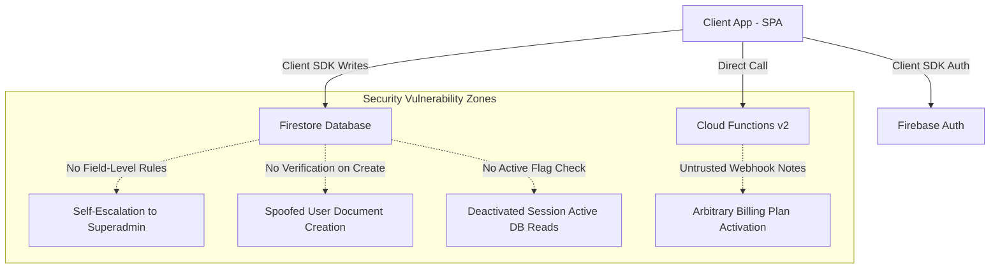

# ARCHITECTURAL SECURITY AUDIT REPORT
**Product Name:** Qualia Bug Tracking & QA SaaS Platform  
**Audit Scope:** Signup, Login, Authentication, Authorization, Tenant Isolation, Database Security, Billing API, and Edge Case Analysis.

---

## 1. EXECUTIVE SUMMARY & QUALITY SCORES

| Metric | Score | Rating |
| :--- | :--- | :--- |
| **Security Score** | **35 / 100** | Critical Risk |
| **Production Readiness Score** | **40 / 100** | Unprepared |

### Summary of General Posture
The Qualia platform possesses a modern, feature-rich React frontend and utilizes standard serverless architectures (Firebase Auth, Cloud Firestore, Cloud Functions). However, a deep code-level audit reveals severe, industry-standard architectural vulnerabilities. 

The primary security failure lies in a **"thick client, thin server"** architecture where highly sensitive operations—such as role assignments, organization structures, and billing updates—rely on client-side actions and lack strict validations in the backend Firestore security rules and Cloud Functions. This leaves the application highly vulnerable to data breaches, vertical privilege escalation, billing fraud, and horizontal tenant bypasses.

---

## 2. DEEP DIVE ARCHITECTURAL REVIEW



### Architectural Strengths
* **Firebase Authentication Integration**: Outsources secure cryptographic password hashing (salted scrypt) and base session validation to Google.
* **Declarative Routing**: Uses custom route guards (`PrivateRoute` and `RoleRoute`) to provide a structured client-side user experience based on roles.

### Structural Vulnerability Patterns
1. **Lack of Field-Level Firestore Constraints**: The rules allow any authenticated user to perform updates on their own user document without restriction, enabling them to self-promote to `super_admin` or hop tenants.
2. **Implicit Trust in Client Payload**: The billing Cloud Function uses client-provided payload data from payment notes rather than verifying the transaction against server-generated orders in Firestore.
3. **Flawed Self-Healing Mechanism**: If an authenticated session exists but the Firestore user document is missing, the frontend automatically self-heals by creating a new organization and granting the user the `Admin` role. This can be exploited to bypass tenant controls.
4. **Weak Storage Rules**: The standard Storage Rules permit any authenticated user to read or write any object in the bucket, violating tenant isolation guidelines.

---

## 3. DETAILED AUDIT FINDINGS

### [FINDING 01] Critical: Self-Escalation to Superadmin via Client Firestore Write
* **Severity**: Critical
* **Exact File Path**: [firestore.rules](file:///home/im0277/Desktop/Abhi/QA/qa-tool/firestore.rules#L51-L55)
* **Function/Method**: `/users/{userId}` update rule
* **Root Cause**: The rule permits updates to a user's own document if `request.auth.uid == userId` without restricting which fields can be modified:
  ```javascript
  allow update: if isSignedIn() && (
    request.auth.uid == userId ||
    isSuperAdmin() ||
    (isOrgAdmin() && isSameOrg(resource.data.organizationId))
  );
  ```
* **Risk Explanation**: Since the client has raw access to the Firestore SDK, any signed-in user can run a console command or custom script to update their own document's `role` field to `super_admin` or `Superadmin`.
* **Real-World Impact**: An attacker registers a free account, updates their role to `'super_admin'`, and instantly gains global access to read, modify, or delete all organizations, projects, bugs, and user accounts on the entire platform.
* **Safer Implementation / Recommended Fix**:
  Restrict users from modifying their own roles or organizations by using `affectedKeys()`. Update the user document rule to:
  ```javascript
  allow update: if isSignedIn() && (
    (request.auth.uid == userId && 
     !request.resource.data.diff(resource.data).affectedKeys().hasAny(['role', 'organizationId', 'isActive', 'email'])) ||
    isSuperAdmin() ||
    (isOrgAdmin() && isSameOrg(resource.data.organizationId) && 
     !(request.resource.data.role in ['super_admin', 'Superadmin']))
  );
  ```

---

### [FINDING 02] Critical: Deactivated Users Maintain Full DB Access
* **Severity**: Critical
* **Exact File Path**: [firestore.rules](file:///home/im0277/Desktop/Abhi/QA/qa-tool/firestore.rules#L14-L25)
* **Function/Method**: `isSuperAdmin()`, `isSameOrg()`, and `isOrgAdmin()` helper functions
* **Root Cause**: These security rule helpers load user data from Firestore using `getUserData()` but fail to verify if the user's `isActive` flag is `true`:
  ```javascript
  function getUserData() {
    return get(/databases/$(database)/documents/users/$(request.auth.uid)).data;
  }
  ```
* **Risk Explanation**: When an admin deactivates a team member, the database sets `isActive = false` and the frontend forces a logout *if* they are using the client UI. However, their Firebase Auth JWT session token remains valid for up to 1 hour, and they can continue making raw API requests directly to Firestore.
* **Real-World Impact**: A disgruntled employee who has been deactivated can write scripts to scrape, download, or delete all sensitive bug data and project codes of their former organization before their session expires.
* **Safer Implementation / Recommended Fix**:
  Enforce active status checking in all helper functions inside `firestore.rules`:
  ```javascript
  function isUserActive() {
    return getUserData() != null && getUserData().isActive == true;
  }
  
  function isSuperAdmin() {
    return isSignedIn() && isUserActive() && getUserData().role in ['super_admin', 'Superadmin'];
  }

  function isSameOrg(resourceOrgId) {
    return isSignedIn() && isUserActive() && getUserData().organizationId == resourceOrgId;
  }

  function isOrgAdmin() {
    return isSignedIn() && isUserActive() && getUserData().role in ['org_admin', 'super_admin', 'Admin', 'Superadmin', 'Manager'];
  }
  ```

---

### [FINDING 03] Critical: invitedData Spoofing & Organization Hijack
* **Severity**: Critical
* **Exact File Path**: [AuthContext.jsx](file:///home/im0277/Desktop/Abhi/QA/qa-tool/src/contexts/AuthContext.jsx#L81-L99)
* **Function/Method**: `signup()`
* **Root Cause**: During Phase 3 of signup, the system queries the `users` collection for pending invitations using the user's email:
  ```javascript
  const q = query(collection(db, 'users'), where('email', '==', email.toLowerCase()));
  const snap = await getDocs(q);
  ```
  Since `firestore.rules` allows *any* signed-in user to create records in the `users` collection without validation, anyone can write dummy placeholder records with an arbitrary email, custom role, and organization association.
* **Risk Explanation**: A malicious user can pre-create a document in `/users` with the email of a high-value corporate target, setting `"invited": true`, `"role": "super_admin"`, and a specific target `"organizationId"`. When the target signs up, they are automatically granted `super_admin` status or forced into an attacker-controlled workspace.
* **Real-World Impact**: Serious cross-tenant data leakage and privilege escalation where malicious users inject fake invitation metadata to hijack the accounts of legitimate registrants.
* **Safer Implementation / Recommended Fix**:
  1. Enforce strict Firestore rules on `/users` creation so that only a verified Admin can create invited placeholders.
  2. Implement an isolated `/invitations` collection that verified Org Admins write to, and make sure to validate the invitation cryptographically or on a secure backend Cloud Function instead of the frontend client.

---

### [FINDING 04] High: Billing Bypass & Arbitrary Tier Activation via Spoofed Webhook
* **Severity**: High
* **Exact File Path**: [index.js (Cloud Functions)](file:///home/im0277/Desktop/Abhi/QA/qa-tool/functions/index.js#L244-L257)
* **Function/Method**: `razorpayWebhook`
* **Root Cause**: The webhook processes `payment.captured` events and updates organization subscription status using notes provided in the transaction:
  ```javascript
  const payment = req.body.payload.payment.entity;
  const orgId = payment.notes?.organizationId;
  ```
* **Risk Explanation**: Razorpay webhooks authenticate that the request comes from Razorpay, but they do *not* verify that the payment amount matches the expected price of the subscription. An attacker can pay 1 INR, attach a target `organizationId` to the payment notes, and the webhook will blindly activate the subscription.
* **Real-World Impact**: Complete commercial bypass of the SaaS billing system. Anyone can activate premium memberships for any organization for free or for negligible amounts.
* **Safer Implementation / Recommended Fix**:
  Never rely on client-controlled transaction notes. When the order is created in `createRazorpayOrder`, store the order details (expected amount, target orgId, pending status) inside a secure `/orders` collection in Firestore. When the webhook is received, verify that `payment.order_id` matches a pending order, that the `payment.amount` matches the expected amount, and only then upgrade the subscription.

---

### [FINDING 05] High: Invited User Account Overwrite & Self-DOS
* **Severity**: High
* **Exact File Path**: [AuthContext.jsx](file:///home/im0277/Desktop/Abhi/QA/qa-tool/src/contexts/AuthContext.jsx#L45-L74)
* **Function/Method**: `signup()`
* **Root Cause**: If a user attempts to sign up with an email that is already registered, the code attempts to sign them in using the provided password:
  ```javascript
  if (isEmailInUse) {
    try {
      const result = await signInWithEmailAndPassword(auth, email.toLowerCase(), password);
      user = result.user;
    } ...
  }
  ```
  Once signed in, it proceeds to run Phase 2-5 of registration anyway, overwriting the user's Firestore document with `setDoc(doc(db, 'users', user.uid), userData)` and creating a new organization!
* **Risk Explanation**: If a valid user attempts to sign up again with their email and correct password, their active Firestore user record is entirely wiped, their existing organization links are broken, and they are reassigned to a newly created empty workspace.
* **Real-World Impact**: Self-inflicted Denial of Service (DOS) and devastating data loss where users accidentally wipe out their roles, company associations, and historical project logs.
* **Safer Implementation / Recommended Fix**:
  If the email is in use, throw a clear error and tell the user to navigate to the Login page. Do not mix signup and login states.

---

### [FINDING 06] High: No-Auth ID Spoofing in User Profile Creation
* **Severity**: High
* **Exact File Path**: [firestore.rules](file:///home/im0277/Desktop/Abhi/QA/qa-tool/firestore.rules#L36-L38)
* **Function/Method**: `/users/{userId}` create rule
* **Root Cause**: The create rule for users is:
  ```javascript
  allow create: if isSignedIn();
  ```
  It does not enforce that the created document ID matches the creator's actual authenticated UID.
* **Risk Explanation**: Any signed-in user can execute a write to create a user profile document under *any* target UID, corrupting administrative user profiles or blocking other users from registering.
* **Real-World Impact**: State corruption, account locks, and potential identity spoofing.
* **Safer Implementation / Recommended Fix**:
  Enforce UID matching during profile creation:
  ```javascript
  allow create: if isSignedIn() && request.auth.uid == userId;
  ```

---

### [FINDING 07] High: Global Read/Write Permissions in Cloud Storage
* **Severity**: High
* **Exact File Path**: [storage.rules](file:///home/im0277/Desktop/Abhi/QA/qa-tool/storage.rules#L4-L6)
* **Function/Method**: Cloud Storage Rules matching all paths
* **Root Cause**: The rules permit unrestricted read/write access to all objects in the bucket as long as a user is authenticated:
  ```javascript
  match /{allPaths=**} {
    allow read, write: if request.auth != null;
  }
  ```
* **Risk Explanation**: There is absolutely no tenant or folder isolation enforced at the Storage layer.
* **Real-World Impact**: Any user from "Company A" can view, download, modify, or delete sensitive screenshots, private logs, or attachments uploaded by "Company B".
* **Safer Implementation / Recommended Fix**:
  Implement folder names structured by `organizationId` and validate against the user's Firestore organization:
  ```javascript
  match /organizations/{orgId}/{allPaths=**} {
    allow read, write: if request.auth != null && 
                         firestore.get(/databases/$(database)/documents/users/$(request.auth.uid)).data.organizationId == orgId;
  }
  ```

---

### [FINDING 08] Medium: Broken Client Status Portal Feature (Permissions Failure)
* **Severity**: Medium
* **Exact File Path**: [firestore.rules](file:///home/im0277/Desktop/Abhi/QA/qa-tool/firestore.rules#L80-L90)
* **Function/Method**: `/projects/{projectId}` read rules
* **Root Cause**: The client-side status page `/public/:projectId` is designed for unauthenticated public visitors:
  ```javascript
  {/* Public View (No Auth) */}
  <Route path="/public/:projectId" element={<PublicProjectPage />} />
  ```
  However, the Firestore rules for projects restrict read access:
  ```javascript
  allow read: if isSuperAdmin() || isSameOrg(resource.data.organizationId);
  ```
* **Risk/Logic Failure**: Unauthenticated clients get blocked by Firestore Security Rules when fetching public project and bug data.
* **Real-World Impact**: The client status portal is completely broken and throws "Project not found or access restricted" for external users. If rules are loosened without checks, it exposes internal private projects to the open web.
* **Safer Implementation / Recommended Fix**:
  Add an explicit `isPublic` flag on the project document and update the rule:
  ```javascript
  allow read: if isSuperAdmin() || 
                 isSameOrg(resource.data.organizationId) || 
                 resource.data.isPublic == true;
  ```

---

### [FINDING 09] Medium: Schema Desynchronization and Broken AI Quota Controls
* **Severity**: Medium
* **Exact File Path**: [index.js (Cloud Functions)](file:///home/im0277/Desktop/Abhi/QA/qa-tool/functions/index.js#L25-L35) vs [AuthContext.jsx](file:///home/im0277/Desktop/Abhi/QA/qa-tool/src/contexts/AuthContext.jsx#L117-L122)
* **Function/Method**: `checkAndIncrementQuota`
* **Root Cause**: During signup, the database initializes:
  ```javascript
  subscription: { plan: 'free', status: 'active', aiQuota: 100, aiUsed: 0 }
  ```
  However, the Gemini Cloud Function checks:
  ```javascript
  const usage = data.aiUsage || { currentUsage: 0, monthlyLimit: 50 };
  ```
  And writes increments to `"aiUsage.currentUsage"`.
* **Risk/Logic Failure**: The system uses two completely different data structures. AI counts never increment `subscription.aiUsed`, meaning the frontend will always display `0` usage. Concurrently, paid users who should have higher limits are throttled at the fallback limit of 50.
* **Real-World Impact**: Complete failure of subscription quota limits and broken dashboard analytics.
* **Safer Implementation / Recommended Fix**:
  Reconcile the database keys:
  ```javascript
  // Cloud Function
  const usage = data.subscription || { aiUsed: 0, aiQuota: 50 };
  if (usage.aiUsed >= usage.aiQuota) {
     throw new HttpsError("resource-exhausted", "Quota exceeded.");
  }
  await orgRef.update({
    "subscription.aiUsed": usage.aiUsed + 1
  });
  ```

---

### [FINDING 10] Low: Unsecured /invitations Tenant Leaks
* **Severity**: Low
* **Exact File Path**: [firestore.rules](file:///home/im0277/Desktop/Abhi/QA/qa-tool/firestore.rules#L109-L113)
* **Function/Method**: `/invitations/{inviteId}` rules
* **Root Cause**: The read rule for invitations is:
  ```javascript
  allow read: if isSignedIn();
  ```
  It does not check that the invitation belongs to the user's organization.
* **Risk Explanation**: Any logged-in user can query the entire `/invitations` collection across all organizations, leaking corporate email addresses and pending positions.
* **Safer Implementation / Recommended Fix**:
  Add organization check to invitations rules:
  ```javascript
  allow read: if isSignedIn() && (isSuperAdmin() || resource.data.organizationId == getUserData().organizationId);
  ```

---

## 4. SUGGESTED ENTERPRISE-GRADE PROTECTIONS & RECOMMENDATIONS

### A. Strict Role-Based Access Control (RBAC) in Firestore
Ensure that all security rules explicitly enforce field-level protections. Standard users must never be able to alter critical flags such as `role`, `organizationId`, or `isActive`. All sensitive fields should be updated only via admin actions or trusted Cloud Functions.

### B. Secure Token & Session Invalidation
Implement token revocation checks using Firebase Auth Admin SDK. When a user is deactivated:
1. Set `isActive = false` in Firestore.
2. Revoke their active sessions immediately in Firebase Auth via `auth.revokeRefreshTokens(uid)` using a backend Cloud Function.

### C. Rate Limiting and API Abuse Mitigation
Implement client-rate limiting on critical Auth routes using Cloud Armor, or deploy custom Express rate-limit middleware for Cloud Functions. Cloud Functions calling third-party generative APIs (like Gemini) must enforce strict sliding-window rate limits (e.g. 5 calls per minute per user).

### D. Audit Logging
Ensure that all critical operations (e.g. role modification, billing webhook capture, user deactivation) write to a secure, write-once `/audit_logs` collection. This log must not be modifiable or deletable by any user (including org admins).

---

## 5. TECHNICAL DEBT & SCALABILITY OBSERVATIONS
* **Overuse of `get()` in Security Rules**: Calling `get()` inside Firestore rules introduces performance overhead and adds to billing cost. Consider caching variables or encoding roles inside Custom Claims in Firebase Auth.
* **Custom Claims Migration**: Moving role management (like `super_admin` and `Admin`) from Firestore lookups to Firebase Auth Custom Claims will cut database overhead to zero and increase security rule evaluation speeds.
